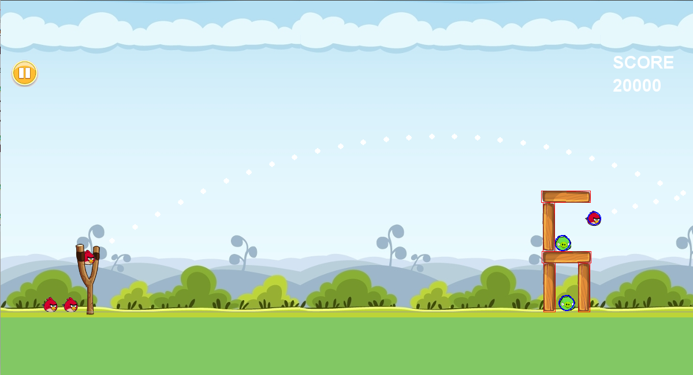
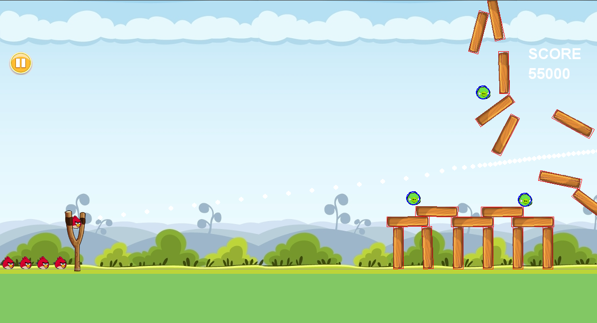

# Angry Birds Game : Pygame + 2D Physics Library Pymunk  
Pymunk is a easy-to-use pythonic 2d physics library that can be used whenever you need 2d rigid body physics from Python. This is perfect because 2d physics is absolutely necessary in the Angry Birds game! From simple concepts like static and dynamic body types, to complex rigid body dynamics, everything has been covered here. Spaces are the basic unit of simulation. Addition of rigid bodies, shapes and joints to the space and then stepping them all forward together through time is the main logic of this library.  
  
  
    
  
  
  
  
There are 4 different files in our game:  
#### 1. main.py  
- Main File of the Game. All the libraries and files will be synchronized and the main game loop will run from here.  
#### 2. polygon.py  
- `Class Polygon:` : This class is used to create the polygons (beams and columns) for all the levels of the game. This is done by initialising the body, space, shape, friction, elasticity, collision_type of the polygon.   
#### 3. characters.py  
- `Class Bird` : Represents the Bird Class. It's position and trajectory will be determined by the input given by the user which will be handled in main.py.  
- `Class Pig` : Represents the Pig Class. Multiple Instances of this class will be used to create different polygons and levels of the Game.  
#### 4. level.py  
- `Class Level` : Used to define the structure of different levels of the game. User defined functions can be used to yield classic pattern templates.  
  
    
### Wall can be toggled by the key 'W'  
  
  
  

### Gravity - Zero can be switched on by the key 'Z'  
  
  
  
  
  
  
  
  
  
The functions which are used :  
- `Polygon.draw_poly(self, element, screen):` : Used to draw polygons on the screen with the specified gravity and body properties.  
- `Level.open_flat(self, x, y, n):` : Used to draw a polygon which looks like a open flat (covers 3 out of the 4 sides).  
- `Level.closed_flat(self, x, y, n):` : Used to draw a polygon which looks like a closed flat (covers all 4 sides).  
- `Level.horizontal_pile(self, x, y, n) / Level.vertical_pile(self, x, y, n):` : Used to draw a strictly vertical(only columns) or a strictly horizontal polygon(only beams).  
- `Level.build_level(self):` : Will create the level Polygon pattern with the required 2D physics properties with the help of Polygon.draw_poly function.  
- `def to_pygame(self, point):` : As the coordinate description by Pymunk and Pygame are different, a conversion function is mandatory.  
- `def vector(p0, p1):` : Returns a vector in the direction from point p0 to p1.  
- `def unit_vector(v):` : Returns the unit vector in the direction of v.  
- `def sling_action():` : Given the mouse position, the type of collision, the length of the rope stretched, the position of the sling will be defined in this function.  
- `def draw_level_cleared() / draw_level_failed():` : According to the type of collisions, the score obtained and the no. of pigs left, the score will be updated accordingly and the corresponding menu will be drawn on the screen.  
- `def post_solve_bird_pig(arbiter, space, _):` : While handling the collisions, if bird and pig collide , this function will reduce the life of the pig and increment the score accordingly.  
- `def post_solve_bird_wood(arbiter, space, _) / post_solve_pig_wood(arbiter, space, _):` : Similar to the above function.
- `def restart():` : The game should restart and all the parameters will be resetted.  
 

  
  

