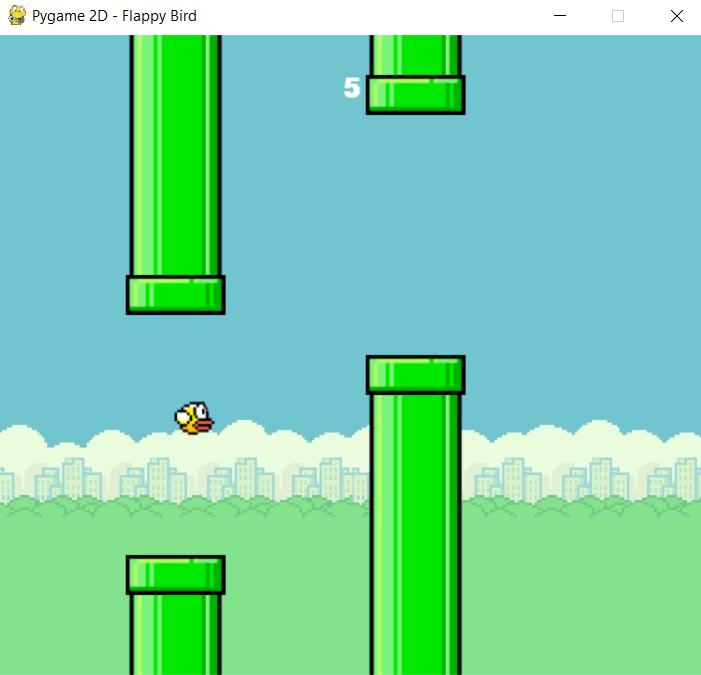

# Fappy Bird Game :-> 2D Pygame  
The game is a side-scroller where the player controls a bird, attempting to fly between columns of green pipes without hitting them. Also a brief introduction to pygame sprites and masks. Specifically, Pygame module for image masks. Useful for fast pixel perfect collision detection. A mask uses 1 bit per-pixel to store which parts collide. We create a Mask object from the given surface by setting all the opaque pixels and not setting the transparent pixels.  
There are 2 main classes which will have their own masks:  
- `class Bird(pygame.sprite.Sprite):` -> To represent the Flappy bird.  
- `class PipePair(pygame.sprite.Sprite):` -> To represent the pipes which come from the right part of the screen.  
  
  
  
  
  
  
  
The functions used in the game / algorithm are:  
### 1. ` def frames_to_ms(frames, fps=FPS): `  
onvert frames to ms at the specified frame rate.  
### 2. ` def ms_to_frames(ms, fps=FPS): `   
Convert ms to frames at the specified frame rate.  
  
  
  
  
  
  
### 3. ` def load_images(): `   
Load all images required by the game and return a dict of them.  
### 4. ` PipePair.collides_with(self, bird): `  
Get whether the bird collides with a pipe in this PipePair where Bird : The Bird which should be tested for collision with this PipePair.  

