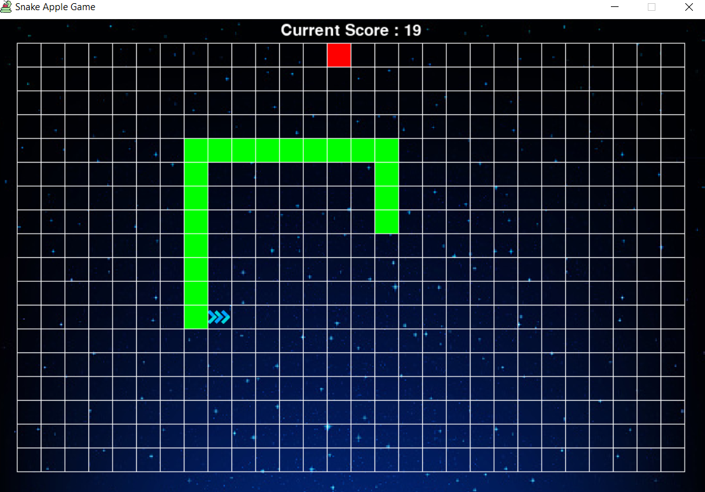

# Snake and Apple Game :-> 2D Pygame
In this pygame based code, the main logic for snake eating an apple and calculate the score is being implemented here. Snake eating itself, or going out of bounds will be calculated in the collision detection function which will find out of two rectangles overlap each other or not.  
The functions used in the game / algorithm are:
1.	### ` def game_intro(): ` This starts the game screen and loads the game. This gives the option of playing the game multiple times.  
2.	### ` def message_to_screen(msg, font_size, center, color, y_displace=0): `  Any random message to the screen can be displayed using this function.    
3.	### ` def snake_coords(snake, x, y, pos): ` Thus function keeps the track of all the points in the snake. A deque is used for its implementation.  
4.	### ` def draw_snake(snake, block_size, img, direction): ` According to the points in the deque, the snake is drawn with its head turning according to the user.  
5.	### ` def draw_grid(): ` Draws the suitable background for the game.  
6.	### ` def gameLoop(): ` This is the main game Loop. All the pre-defined functions along with the pygame module are used here.  

**The following is a visual representation of one of the points in the game. As you can see, the score is also visible. **  

  

